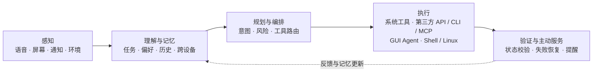

# Eta

**简体中文** | [English](README_EN.md)

   

**面向 Android 的第三方系统级 AI Agent**

Eta 借助 Root 与 LSPosed 越过 App 沙盒，直接进入系统底层：Hook 系统组件，接管电源键与厂商助手入口，读取原厂与第三方应用的私有数据。这些接近原厂、又比原厂更自由的能力，全部开放给你自己接入的模型（ChatGPT、DeepSeek、Kimi 等，自带 API Key——BYOK）：

- **系统 API 直达**：闹钟、媒体、音量、Wi‑Fi 等系统能力，模型可直接调用
- **个人上下文**：相册、日历、短信、通知、录音、健康摘要、ColorOS 系统记忆、QQ / 微信聊天图片等本机数据，模型按需读取
- **内置浏览器**：后台加载网页、提取正文、操作页面元素，需要时可由用户直接接管
- **Root / Linux 环境**：完整的 Shell 环境，授权后执行命令、读写文件、跑脚本，给模型无限的想象空间
- **GUI Agent**：第三方 App 直接开放 API / CLI 才是最理想的路径，但移动互联网生态封闭，绝大多数应用没有任何机器接口；界面又是为人设计的，对模型天生不友好。没有接口的长尾场景，只能由 Agent 看屏幕、找控件、执行操作

其他第三方手机 Agent 面向大众用户，大众用户没有 Root 权限，能力只能做在 App 沙盒里，系统入口和数据仍属于厂商；桌面端的 Coding Agent（Codex、Claude Code）或 OpenClaw 被直接搬进手机时，功能再全，也只是一只困在沙盒里的龙虾，没有完整的系统环境，无法操作真正的 Android 设备；原厂助手则受自家生态约束，不会触碰第三方应用的数据。

Eta 可以看着屏幕、替你点一杯奶茶，但点屏幕不该是终点。能直达系统就不必模拟点击，这台手机在模型手里，就是一台可以使用的计算机。

手机里存放着你大部分的数据。在你的允许下，相册、通知、日程、便签、录音、位置、健康摘要与长期记忆一起成为上下文，Eta 做的事情会超出命令本身：它逐渐知道你在意什么、理解事情的前因后果。没有比手机更懂你的朋友，Eta 可以成为这样的朋友。亲近不意味着失去边界：每种能力都有独立开关，你选择模型，也决定它能看见什么、能做什么，以及什么时候停下来。

> [!NOTE]
> 完整能力需要 **Root** 与支持 libxposed API 102 的 **LSPosed**。App 本体不限 OPPO 或小米设备；ColorOS（小布助手）与 HyperOS（小爱同学）只是当前系统助手入口的适配范围。

## 界面预览

|                         GUI Agent                         |                         小布助手 BYOK：电源键启动                         |
| :-------------------------------------------------------: | :-----------------------------------------------------------------------: |
|  |  |

|              App 本体聊天首页              |                        小布：执行 Shell 命令                        |                       设备直达                       |
| :-----------------------------------------: | :-----------------------------------------------------------------: | :--------------------------------------------------: |
|  |  |  |

|                  设置                  |                工具能力                |                 Skills                 |
| :------------------------------------: | :-------------------------------------: | :------------------------------------: |
|  |  |  |

## 核心能力

Agent 不会问一句答一句就结束：模型发指令，Eta 执行，结果写回上下文，模型再决定下一步，直到做完。四条执行路径可以组合使用：

| 路径                 | 说明                                                                                                                                                                                          |
| -------------------- | --------------------------------------------------------------------------------------------------------------------------------------------------------------------------------------------- |
| **设备直达**   | 闹钟、计时器、媒体控制、音量、Wi‑Fi / 蓝牙、设备与存储状态等系统能力，以及相册、日历、联系人、短信、通知、健康摘要、ColorOS 便签与系统记忆等本机数据检索——全部是有明确 Schema 的结构化工具 |
| **网页浏览**   | 内置浏览器在后台加载 JavaScript 网页、提取结构化正文、操作页面元素；遇到验证码等场景可挂载到 App 界面，由用户直接接管                                                                         |
| **终端与文件** | 授权后执行`user` / `root` shell 命令、读写文件、运行脚本；可选安装预装 Git、`rg` 等工具的 Alpine Linux 环境，Python、Node.js、SSH 与 APK 分析工具集按需加装 |
| **MCP 工具**   | 连接 Streamable HTTP 服务器，把用户逐项启用的第三方工具并入同一 Agent Loop；支持 HTTP / HTTPS 与可选 Bearer Token，工具结果按敏感数据处理 |
| **GUI 操作**   | 截图、无障碍节点、点击、滚动与输入；前台操作时显示浮层与手势反馈，可随时停止或接管。没有系统接口的长尾场景由它补齐                                                                            |

在此基础上：

- **长期记忆**：跨对话记忆保存在本机单一 `MEMORY.md`，按任务按需注入；设置页可查看用量、编辑、清空或关闭
- **Skills**：可浏览并安装公开 GitHub 仓库的 Skill，或导入本地 ZIP；模型按需读取，安装不会自动执行包内脚本
- **会话与结果**：外部入口触发的运行结果归档到 App 会话，进程被杀也会尝试恢复；长按消息可复制、编辑或从该轮删除，最终回复可重新生成

## 使用场景

- **设备直达操作** — “明早 7 点设个闹钟”“暂停音乐”“把媒体音量调到 30%”，优先走结构化系统接口
- **理解最近的自己** — “我最近在忙什么”“这几天是不是总熬夜”“今天把时间花在哪了”，按需结合日程、通知、应用活动、健康摘要和本机记忆归纳
- **安排接下来的一天** — “结合明天的日程、地点和已有闹钟，告诉我几点出门，再补一个提醒”，先理解上下文，再把计划真正落到手机上
- **追踪正在发生的事** — “我的外卖到哪了”“取餐码是什么”“最近有什么快递”，从系统记忆和授权后积累的通知历史中寻找线索
- **找回散落的信息** — “上周那段录音里提到的书叫什么”“找出和这个地点有关的照片与便签”
- **聊天图片回顾** — “看看我最近的 QQ / 微信聊天图片，猜猜我在忙什么”
- **跨 App 操作与比价** — 处理应用里的待办项目，或截图分析淘宝商品、自动打开京东搜索同款；没有直达接口时才由 Agent 看屏幕、找按钮、执行
- **网页研究** — 在后台阅读 JavaScript 渲染的文档或资讯页面；遇到验证码时由用户直接接管
- **终端任务** — “清一下后台，查 LSPosed 日志看 Hook 有没有异常，再看看 Magisk 模块生效了没”
- **系统助手入口触发** — 从 Eta 系统助手面板、小布或超级小爱发起多步任务，交给同一套 Agent Runtime 执行

## 系统助手入口

### Eta 原生数字助理

Eta 通过 Android 标准 `VoiceInteractionService` 注册为可选数字助理：在设置页点击“Eta 系统助手”，再在 Android 的数字助理选择器中选中 Eta 即可。唤起后显示全屏助理面板并自动聚焦键盘输入框，支持流式回答、连续追问、取消与结果归档；可选择把唤起前的当前屏幕作为下一条消息的图片上下文。当前浮窗不提供语音识别或语音播报。

### ColorOS 电源键目标

在设置页的“系统助手接管”中可选择 ColorOS 长按电源键的目标：

| 目标     | 长按后的行为               | 默认助理自动设置        |
| -------- | -------------------------- | ----------------------- |
| 小布助手 | 保留 ColorOS 原始行为      | 不修改系统默认助理      |
| Gemini   | 沿用 Google 的系统助手链路 | 开关开启时切换为 Gemini |
| Eta      | 打开 Eta 全屏键盘助理浮窗  | 开关开启时切换为 Eta    |

新安装默认保持小布；旧版已经开启“长按电源键唤起 Gemini”的用户会继续使用 Gemini。“自动设置默认助理”是独立开关，只对 Gemini 和 Eta 生效。当前目标无法启动时，本次长按会立即回退到小布；HyperOS 电源键入口尚未接入。

### 小布与超级小爱

- **小布（ColorOS）**：接管小布对话入口，继承当前房间的文本上下文并解析图片输入，交给同一套 Agent Runtime 处理；支持 BYOK，默认只在 `/agent` 前缀下触发
- **超级小爱（HyperOS）**：支持文本与单张本地图片或截图，前缀、图片解析或任务入队任一前置检查失败时回到原生链路；已在 `7.13.32.0016`（`507013032`）通过真机验证

### Gemini 与一圈即搜（ColorOS）

这两项功能不依赖 ColorOS 原本提供的入口，由 Eta 创建或修复：

- **Gemini 解锁**：Google App 设备资格补齐、系统化、默认数字助理接管、电源键入口，以及锁屏/亮屏语音输入和息屏热词补偿
- **一圈即搜**：启用并修正原本不可用的 Android `contextual_search` 服务与 Google App 资格，再把手势条长按和双指识屏改造成触发入口，不改系统文件

Gemini 解锁与一圈即搜是 Eta 早期建立的 Google 能力解锁功能，目前不是开发重点，但仍会维护。

## 模型与 BYOK

- **模型协议**：支持 OpenAI-compatible Chat Completions、Responses API 与 Anthropic Messages，覆盖 SSE 流式传输、工具调用、图片输入和推理内容；Responses 可展示推理摘要，并可按 Provider 开启服务端网页搜索
- **内置提供商**：OpenAI、Anthropic、阿里百炼、DeepSeek、Kimi、MiMo、MiniMax、StepFun、硅基流动、OpenRouter
- **自定义提供商**：自定义 HTTP/HTTPS Base URL、API Key、请求头与 body JSON；HTTP 会明文传输 API Key、提示词与模型内容
- **模型管理**：内置官方目录、远程拉取、自定义模型与模糊搜索；可覆盖上下文长度与思考档位，本地覆盖始终优先于后续远程同步；各提供商分别记忆上次选择的模型

BYOK（Bring Your Own Key）意味着 Agent 能力跟随你选择的模型，而不是被单一内置服务商限制。

## 安装

<b>展开安装步骤</b>

1. 安装 APK 并打开 Eta，配置模型提供商、API Key 和当前模型
2. 按需授予悬浮窗、无障碍、应用列表读取、位置、通知使用权、使用情况访问和后台运行等权限；如需从小布等后台入口执行位置任务，位置应授予“始终允许”
3. 按需开启设备直达、敏感信息读取、敏感设备操作和终端/文件工具；可在工具设置中添加远程 MCP 服务器并逐项启用需要的工具；终端身份由用户明确选择为 `user` 或 `root`，需要 Git 等通用命令时可另行安装 Linux 工具环境，Python 工具链在其中按需加装
4. 在系统设置中开启 Eta 无障碍服务
5. 可选系统入口：
   - Eta 原生数字助理：在设置页点击“Eta 系统助手”，并在 Android 系统选择器中将 Eta 设为默认数字助理
   - ColorOS 电源键切换、厂商助手接管、ColorOS 系统记忆、Gemini 与一圈即搜：在支持 libxposed API 102 的 LSPosed 环境中启用模块，按需勾选 `system`、SystemUI、Google App、小布识屏、小布助手、小布记忆和超级小爱作用域，然后重启手机

## 权限与安全

- 设备直达、敏感信息读取、敏感设备操作、终端/文件、网页浏览与记忆均为独立开关，当前默认开启；Runtime 每次执行前重新读取，用户可随时关闭
- 工具参数必须通过 Schema 和执行器校验；核心系统包与安全关键设置始终受保护，不会因为模型坚持要求就被放行
- 短信验证码、Wi‑Fi 密码、通知正文、日志和个人数据检索结果只在当前回合提供给模型，不写入持久会话；通知历史仅在用户授予通知使用权后由 Eta 在本机保存最近 7 天，最多 1000 条
- MCP 工具默认关闭，并可整体停用服务器；HTTP / HTTPS 地址均可直接配置，Bearer Token 加密保存在 Android Keystore 中，工具参数与结果不写入持久会话
- 记忆读写同样只供当前回合使用，持久会话只保留脱敏操作摘要；聊天中引用的文件只把经过 Root 校验的路径写入模型上下文，不上传、不复制原文件
- 前台 GUI 操作显示运行浮层与手势反馈，用户可随时停止或接管

## 边界与限制

- **第三方集成限制**：Eta 无法获得原厂系统组件的全部私有权限，交互 UI、动画衔接和系统级一致性会弱于厂商内置助手
- **版本兼容性**：系统入口 Hook 强依赖 ROM、系统组件和目标 App 的具体实现，系统或 App 大版本更新后可能需要重新适配

## 为什么做 Eta：我对 AI 手机的判断

### 与豆包手机助手的区别

豆包手机助手证明了手机 AI 的方向：从聊天框走向系统级操作。但它是超级 App，有平台资源，也有平台约束——跨 App 接管会撞上第三方应用登录异常、人机验证和银行 App 风险提示。厂商要维护商业关系、支付安全和监管合规，天然被生态绑住手脚。

本项目走第三方开发者路线：不代表手机厂商，不需要维护预装合作。用户愿意解锁、`root`、启用 Xposed 和无障碍，就应该能把自己的手机入口接给自己选择的 Agent。风险边界由用户决定，工具必须透明可见，敏感操作必须能随时停止和接管。

我也不打算让 Agent 为了开个 Wi‑Fi、设个闹钟就在设置页面里来回找按钮。Android 已经有稳定接口的能力，Eta 就直接做成结构化工具交给模型：少一点截图、猜坐标和祈祷页面没改版，多一点真正可验证的系统执行。能直达系统，就没必要假装自己只会点屏幕。

更重要的是，我把终端执行能力放进了 Agent Runtime。普通手机 AI 只会点屏幕，但 Agent 一旦能在用户授权下执行 shell 命令、读写文件、跑脚本、改配置，它就具备了和主流 Coding Agent 同类的“把意图转化为操作”的能力。GUI 是手机表层，终端才是完整计算环境。

### 对 AI 手机与 Agentic OS 的展望

> [!NOTE]
> 本节描述 Eta 对未来 AI 手机的产品与架构判断，不是当前版本已经完整实现的功能清单。

未来的 AI 手机不应只是预装一个更强的聊天助手，也不应把“替用户点击屏幕”当作终点；把电脑上的 Coding Agent 原样搬进手机，同样不等于理解了 AI 手机。它更可能从以 App 和 GUI 为中心的操作系统，逐步转向以用户意图、上下文和 Agent Runtime 为中心的 **Agentic OS**：用户表达目标，系统在授权边界内理解当前情境并完成规划，再选择合适的应用、服务、设备与硬件能力执行，验证结果后向用户交付。

传统 GUI 通过一层层页面和菜单，把人的模糊需求收敛成机器能够处理的具体操作。当模型能够理解自然语言、屏幕、语音、环境和历史状态时，这个结构化过程可以更多地由系统承担。App 不会因此消失，而会逐渐从用户完成任务的唯一入口，转变为 Agent 背后的服务、数据和专业界面，并通过 API、CLI、MCP 等机器接口暴露能力；GUI 则继续承担信息展示、关键确认和用户接管。

系统还可以成为模型的**上下文提供层**。普通 AI App 主要看到用户本轮主动输入的文字、图片和文件；系统级 Agent 则可以按任务读取当前屏幕与通知，以及相册、日程、联系人、通话、短信、便签、录音、订单、健康摘要、设备环境与应用活动等本机数据，再结合时间、位置、使用习惯、个人偏好和跨设备任务进度理解用户。Eta 已经实现其中一部分：模型可以调用职责明确的检索工具获得有界结果，并用独立的通用图片工具读取明确路径。它不做无差别全盘扫描，只在正确时机取回完成当前任务所需的上下文，让模型理解用户正在做什么、此前发生了什么以及下一步需要什么。更完整的原厂方案仍应提供敏感度分级、来源说明、使用记录与随时撤回能力。

在执行层，Agentic OS 应根据权限、能力可用性、速度、稳定性和风险选择路径：

1. **系统能力与数据直达**：系统 API、Provider、已验证的本机数据源和专用设备工具直接读取状态与任务上下文、控制硬件或完成系统动作，不必打开页面模拟点击。
2. **第三方 App 结构化直达**：当应用或服务提供 API、CLI、MCP、AppFunctions 或其他机器接口时，模型可以直接读取业务状态并调用能力，不进入第三方 App 的 GUI。这是速度、稳定性和可验证性更好的理想路径。
3. **GUI Agent 补齐未开放生态**：当第三方 App 没有提供任何可用的 API、CLI、MCP 或开放协议时，再通过截图、无障碍节点、视觉模型和坐标操作完成任务。GUI 原本是为人设计的，依赖页面布局和视觉识别，也不天然向模型提供稳定语义、状态与可验证结果，因此对模型并不友好，更适合作为长尾兼容和过渡方案。
4. **Shell/Linux 扩展计算边界**：在用户明确授权下，Android Shell、文件系统与 Linux 工具可以承载系统诊断、脚本、开发和复杂计算任务，为 Agent 提供完整计算环境。

> [!IMPORTANT]
> API、CLI、MCP 都可以成为 Agent 直接操作第三方 App 或服务的机器接口，但前提是对方公开提供或通过生态合作授权。Root 可以让 Eta 读取用户设备上已存在、格式已经验证的 Provider 或文件数据，例如聊天图片缓存，但这不等于获得第三方 App 的业务 API，更不能自动理解私有协议。Eta 不开放任意数据库、URI 或 SQL 给模型；面对没有开放接口、也没有专门数据适配的第三方业务，仍需由 GUI Agent 操作。

一套完整的 Agentic OS 可以被理解为以下连续链路：

| 架构阶段     | 未来 Agentic OS                                                                | Eta 当前覆盖                                                                                                                                                                                                                                                    |
| ------------ | ------------------------------------------------------------------------------ | --------------------------------------------------------------------------------------------------------------------------------------------------------------------------------------------------------------------------------------------------------------- |
| 感知与上下文 | 屏幕、语音、通知、日程、时间与位置、使用习惯、长期记忆与跨设备状态             | 图片输入与本机路径读取、屏幕观察、无障碍节点、时间与位置、设备环境、当前与授权后有限期保存的通知、应用活动与使用时长、闹钟与计时器、健康摘要、个人订单、相册、文件、日历、联系人、通话、短信、ColorOS 便签与录音、QQ / 微信聊天图片缓存、会话历史与按需长期记忆 |
| 规划与编排   | 意图识别、任务规划、风险判断与模型调度                                         | Agent Loop、工具 Schema、系统约束、补充指令与取消                                                                                                                                                                                                               |
| 能力路由     | 系统能力直接调用；第三方 App 通过 API、CLI、MCP 等接口直达，GUI 覆盖未开放生态 | Android 系统工具、系统与厂商 Provider、已验证的本机文件数据、GUI Agent、浏览器、Skills 与终端工具；不包含第三方 App 私有业务接口                                                                                                                                |
| 执行环境     | App、系统服务、文件、传感器、算力单元与多设备                                  | Android user/root Shell、文件工具与 Alpine Linux                                                                                                                                                                                                                |
| 结果闭环     | 状态验证、失败恢复、按风险确认与主动服务                                       | 结构化工具结果、重新观察、状态等待、事件流、结果归档与用户接管                                                                                                                                                                                                  |

对原厂 Agentic OS 而言，相比普通 AI App 的独特价值在于：在用户授权和数据治理边界内获得连续的系统上下文，维护可控的长期记忆，调度跨应用与跨设备能力，并把回答转化为经过验证的实际结果。主动服务也必须保持克制：上下文应按任务最小化注入，数据来源与用途应透明，持续感知应按需且可见，敏感能力应显式授权，高风险操作应结合用户指令和风险等级确认，执行过程应可停止、可接管，结果应能够校验和追溯。

Eta 作为第三方项目，正在验证这条路线中可以在现有 Android、Root、无障碍和用户授权边界内实现的部分：以同一套 Agent Runtime 编排系统与个人数据工具、通用图片视觉、GUI、浏览器、Shell、Linux、Skills 与按需长期记忆，让 Android 能力直达、本机上下文读取和第三方 App 的通用界面操作互为补充。更完整的 Agentic OS 仍需要跨设备记忆与状态同步、端侧模型、硬件资源调度、数据治理和第三方生态共同演进。

## 深入了解

- [技术实现](TECHNICAL.md)：Hook 链路、个人数据直达、文件视觉、浏览器、终端、长期记忆与无障碍保护细节
- [Agent Runtime](AGENT_RUNTIME.md)：Agent Loop、工具批次、steering 与 transcript 语义

## 参考与致谢

- [Pi Coding Agent](https://github.com/earendil-works/pi)：Eta Agent Runtime 的核心参考，包括 Agent Loop、工具调用、steering 与 transcript 状态管理
- [OmniBot](https://github.com/omnimind-ai/OmniBot)：Android 端 AI Agent 方向的参考项目
- [libxposed API](https://github.com/libxposed/api)：现代 Xposed API
- [Miuix](https://github.com/compose-miuix-ui/miuix)：UI 组件库

## 许可证

Eta 的源代码公开，欢迎用于个人学习、研究、修改和非商业用途。完整条款请参阅 [PolyForm Noncommercial License 1.0.0](../LICENSE)。

未经作者书面授权，不得销售本项目、其源码、APK 或修改版本，也不得基于本项目提供付费分发、收费代装或其他商业服务。如需商业授权，请通过 GitHub 联系 [蛮吉（Mangi-11）](https://github.com/Mangi-11)。

第三方依赖、图标和品牌素材适用各自的许可证，不由 Eta 的许可证重新授权，详情见[第三方声明](THIRD_PARTY_NOTICES.md)。

为确保项目能够统一授予商业许可，外部代码贡献需要在贡献者许可协议（CLA）流程建立后才能合并；在此之前欢迎通过 Issue 提交建议和问题。

Community: <a href="https://linux.do">LINUX DO</a>
