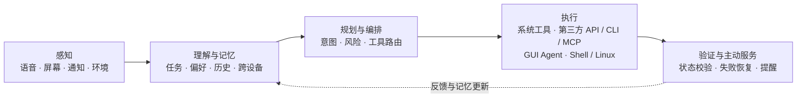

# Eta

**简体中文** | [English](README_EN.md)

<p>   </p>

**面向 Android 的第三方系统级 AI Agent**

让模型更懂用户，以结构化接口读取本机数据、调用系统 API 并控制设备；也能用 GUI Agent 完成必须进入 App 界面的操作，借助 Root / Linux 进入完整计算环境，处理更广泛、更复杂的任务。

让 AI 看着屏幕、替你点一杯奶茶，Eta 已经做到了。但这也暴露了 GUI Agent 的边界：界面是为人设计的，模型完成一个简单操作也要反复获取截图和控件信息，在广告与弹窗的干扰中寻找目标；每一步都会消耗大量上下文、推理和调用成本，完成同一任务的速度也远慢于直接调用结构化接口。GUI 是 Eta 连接今天封闭 App 生态不可缺少的通用兼容层，却不该是 AI 手机的终点。

Eta 更想做的，是让手机原本藏在界面背后的能力真正向模型打开：能直达系统的就调用有明确 Schema 和结果的结构化工具，应用提供 API、CLI 等机器接口时就直接使用；没有接口的长尾场景再交给 GUI Agent。网页由可接管的内置浏览器处理，脚本、诊断与复杂计算则进入 Android Root Shell 和 Alpine Linux。所有路径都由同一套 Agent Runtime 编排，让模型不只会点手机，而是真正拥有一台可以使用的计算机。

而当相册、通知、日程、便签、录音、位置和健康摘要，乃至微信、QQ 的近期聊天图片、外卖订单与配送动态，在你的允许下与长期记忆一起成为上下文，Eta 也不只是在完成命令。它可以逐渐知道你在意什么、理解事情的前因后果，在需要时帮上忙，在想聊聊时记得你是谁——既是能干的助手，也可以成为更懂你的朋友。亲近不意味着失去边界：每种能力都有独立开关和执行范围，敏感原始结果不会写入持久会话；你选择模型，也决定它能看见什么、能做什么，以及什么时候停下来。

> [!NOTE]
> Eta App 本体面向已 Root 的 Android 设备，不限于 OPPO 或小米设备。ColorOS 与 HyperOS 只是当前系统助手入口的适配范围：ColorOS 上可将 Eta 选为默认数字助理，小布与超级小爱则作为兼容入口，共用同一套 Agent Runtime 和 BYOK 模型配置。完整的系统集成能力需要 Root 和 LSPosed。

## 界面预览

|                         GUI Agent                         |                         小布助手 BYOK：电源键启动                         |
| :-------------------------------------------------------: | :-----------------------------------------------------------------------: |
|  |  |

|              App 本体聊天首页              |                      小布：执行 Shell 命令                      |                       设备直达                       |
| :-----------------------------------------: | :------------------------------------------------------------: | :--------------------------------------------------: |
|  |  |  |

|                  设置                  |                工具能力                |                 Skills                 |
| :------------------------------------: | :-------------------------------------: | :------------------------------------: |
|  |  |  |

## 核心能力

Agent 不会问一句答一句就结束。它在一个 loop 里运转：模型发指令，系统执行，结果写回上下文，模型再决定下一步。如此往复，直到做完。

Eta 有四条可以组合使用的执行路径：有稳定系统接口时调用结构化设备工具，没有合适接口时通过 GUI 操作应用，网页任务交给内置浏览器，需要完整计算环境时进入 Android Shell 或 Linux 工具环境。

### 设备直达：让 AI 调用系统，而不是学习怎么点手机

> 当普通手机 Agent 还在截图、找按钮、猜坐标时，Eta 已经把任务交给 Android 系统直接完成。

“明早 7 点叫我起床”“暂停音乐”“把媒体音量调到 30%”“开启 Wi‑Fi”“看看哪个应用最占空间”——Eta 会把这些自然语言转换成参数明确的设备工具调用。模型不需要先打开设置、等待动画、识别开关，再祈祷界面没有改版。

而当问题不是“替我点一下”，而是“帮我想清楚”时，系统上下文会更重要。“我明天几点出门合适”需要把日程、地点和闹钟放在一起；“最近是不是休息得不太好”可能需要结合睡眠摘要、应用使用和近期安排；“外卖还有多久到”则要从系统记忆和授权后保存的通知中找到订单状态。Eta 让模型按任务取回这些有界事实，再决定是回答、提醒，还是继续调用设备能力完成下一步。手机不再只是 Agent 手里的一块触摸屏，也成为它理解用户的上下文来源。

这不是在 System Prompt 里写几句“我可以控制手机”。Eta 为模型提供了一套真正可执行的结构化设备工具：`set_alarm`、`set_timer`、`set_device_state`、`set_volume`、`device_status`……每个工具都有独立的参数 Schema、权限分组、执行器和结构化结果。模型负责决定做什么，Runtime 负责可靠地在这台手机上完成。

这也不是一张做到这里就封顶的功能清单。结构化设备工具是 Eta 会持续扩展的核心能力层：后续更多系统状态、设备控制和应用动作会不断以独立 Schema 与专用执行器接入。能直达的能力就不再堆 GUI 脚本，让模型可用的手机能力随着版本持续增长。

- **时间与媒体**：直接创建闹钟和计时器，控制播放、暂停、切歌，并按媒体、铃声、通知和闹钟通道精确调整音量
- **设备状态**：读取电池、充电、内存、存储、系统版本、运行时间和当前网络，直接开启或关闭 Wi‑Fi、蓝牙
- **应用洞察**：找出最占内存的进程和最占存储的应用，不必打开系统管家逐页查找
- **深度系统能力**：读取当前通知、授权后有限期保存的通知历史、应用活动与使用时长、闹钟、计时器、位置、勿扰和外接设备状态，并查询短信验证码、Wi‑Fi 凭据、Android Settings 与有界系统日志
- **个人数据直达**：检索相册图片、音频、录音、共享文件、下载、日历、联系人、通话记录、短信、剪贴板历史与健康摘要；在 ColorOS 上还可检索便签、待办、录音摘要与小布记忆中的账单、日程、取件码、快递、地点、附件及个人订单
- **聊天图片发现**：从 QQ、微信已验证的聊天图片缓存目录中查找最近图片，只返回有界的文件元数据和路径，不读取消息数据库、聊天正文或视频
- **通用图片读取**：通过 `read_image` 读取系统相册 URI 或任意本机绝对图片路径，再作为视觉输入交给模型；多张图片逐张读取，避免一次请求塞入多图而卡住
- **设备管理**：修改非安全关键 Settings，停止、冻结或恢复指定应用；核心系统包和安全关键设置始终受保护

有稳定系统接口的任务优先直达；只有 Android 或目标应用没有提供合适接口时，才退回无障碍 GUI。GUI 仍然是 Eta 跨应用操作的通用能力，但不再是每件事都必须经过的笨重中间层。

| 普通 GUI Agent                     | Eta 设备直达                       |
| ---------------------------------- | ---------------------------------- |
| 截图、识别按钮、模拟点击           | 调用职责明确的结构化工具           |
| 依赖坐标、文案和当前页面布局       | 优先依赖 Android 系统接口          |
| 页面改版、弹窗或动画都可能打断流程 | 多数操作不受设置页面变化影响       |
| 只能观察界面是否“看起来成功”     | 执行器返回可供模型继续判断的结果   |
| 所有能力都挤在同一套 GUI 操作里    | 不同能力拥有独立 Schema 和执行边界 |

Eta 不要求用户背固定口令，也不会拿一份关键词表审核一句话“够不够明确”。相应能力开启后，模型可以根据任务直接调用。安全也不是靠每一步都反问用户，而是落在真正执行动作的地方：

- 设备能力分为“设备直达、敏感信息读取、敏感设备操作”三组开关，当前均默认开启；Runtime 每次执行前都会重新读取，用户可随时关闭
- 工具参数必须通过 Schema 和执行器校验；核心包、安全关键设置和越界参数不会因为模型坚持要求就被放行
- 短信验证码、Wi‑Fi 密码、通知正文、日志和个人数据检索结果只在当前回合提供给模型，原始参数与结果不会写入持久会话；通知历史仅在用户授予通知使用权后由 Eta 在本机保存最近 7 天，最多 1000 条
- 记忆读取结果和写入参数同样只供当前回合使用，持久会话与运行轨迹只保留脱敏操作摘要

### GUI 操作

- **屏幕与控件**：截图、读取带快照标识的无障碍节点、按节点或坐标点击，以及带位移验证的四向滚动
- **应用与系统**：启动 App、把链接显式交给外部应用、模拟按键、下拉通知栏、搜索应用
- **文本与剪贴板**：输入文字、设置剪贴板、粘贴、等待特定文本出现
- **运行可视化**：前台操作时显示浮层与手势反馈，让你知道它正在点哪里、怎么滑

### 网页浏览

`browser_use` 是运行在 Eta 内的 Agent 浏览器，不是简单调用系统 `ACTION_VIEW`。它可以在不抢占前台的情况下加载 JavaScript 网页、提取保留标题/段落/列表/链接等结构的正文、查找并操作页面元素、提交表单、滚动和截图；用户想查看过程时，可在 App 中挂载同一个 WebView 直接接管。外部打开链接仍由独立的 `open_uri` 工具负责，两种能力不会混淆。

Eta 不对浏览器请求执行额外的 URL、DNS、IP、主机数量、请求方法、重定向或 Service Worker 拦截，页面直接交给系统 WebView 加载。浏览器允许本地内容、混合内容、第三方 Cookie、自动媒体播放和表单提交；系统 WebView 与 Android 平台自身的协议支持、TLS 校验和权限行为保持不变。网页工具可在设置中关闭。

### 终端与文件

在用户授权下执行 `user` 或 `root` shell 命令，读写文件、列目录、跑脚本、查日志、改配置。会话式 shell 保持 cwd 和环境变量，异步任务后台执行并分段读取输出。聊天中的终端工具卡片可展开查看并复制实际执行的完整命令；运行日志仍只记录长度等受控摘要，不记录命令正文。终端/文件工具当前默认开启，用户可在设置中关闭。

聊天输入栏可以引用内部存储与 `/data/local/tmp` 下的文件或文件夹，发送后以附件名称和原始请求分开展示。Eta 只把经过 Root 校验的规范绝对路径写入模型上下文，不上传、不复制或缓存原文件；模型再按任务调用文件或终端工具读取。系统文件选择器会解析内部存储文档，以及能转换为本地媒体库路径的“最近”文件；云盘和其他只有 `content://` URI 的来源不会降级为上传。

终端按用途分为两个环境：

- `android` 是原生 Android Shell，负责系统、应用、日志、Magisk 和设备文件操作。Root 会话会自动发现 Magisk、KernelSU 或 APatch 提供的 BusyBox，并以 standalone `ash` 补齐不在系统 PATH 中的 applet。
- `linux` 是可选安装的 Alpine 工具环境，预装模型高频使用的 `rg`、`fd`、Git/SSH、diff/patch、curl、rsync、jq、SQLite、常用压缩工具与 Python 工具链。Eta 下载固定版本的官方 minirootfs 并校验 SHA-256，在 App 私有目录中解压，通过独立 mount namespace + Root chroot 运行；Linux 默认在映射到 Eta Android 工作目录的 `/workspace` 中执行，共享存储位于 `/sdcard`。它不是安全沙箱，也不会取代 Android 环境。

### 记忆

Eta 使用 App 私有目录中的单一 `MEMORY.md` 保存跨对话长期记忆，不额外调用提取模型或运行后台整理任务。当前对话的主模型根据需要调用 `memory_get` 与 `memory_write`，负责去重、修正冲突和删除过期信息。

- **按需注入**：每轮只自动提供预算内的 `# 核心记忆`、标题索引和文件 revision；详细章节由模型按任务检索，不把整个文件反复塞进上下文
- **动态预算**：核心注入量根据当前模型上下文窗口计算；窗口未知时按 128K 处理，并始终为历史、工具、图片和回复预留空间
- **原子更新**：文件上限为 1 MiB UTF-8 字节，模型使用 revision 进行局部更新，冲突时必须重新读取；完整文件通过 `AtomicFile` 覆盖，失败保留旧内容
- **用户控制**：设置页可查看用量、编辑完整 Markdown、清空或关闭记忆；关闭不会删除文件，但 Runtime 会立即停止注入并拒绝新的记忆工具调用

### Skills

- **AI 安装**：Eta 可以浏览公开 GitHub 仓库、列出候选 Skill，并直接安装模型选定的候选；也支持 `$skill-installer`
- **本地 ZIP**：在 Skills 页面选择只包含一个 Skill 的 ZIP 包导入；压缩包会先在 App 私有目录中完成路径、大小、结构和 `SKILL.md` 校验，再写入正式目录
- **冲突保护**：同名用户 Skill 默认不覆盖；GitHub 安装发生单个可替换冲突时，可按同一仓库、提交、路径和 ID 精确重试，内置 Skill 永远不会被导入包覆盖
- **按需读取**：模型先看到已启用 Skill 的索引，需要时再读取正文和引用资源。新安装的 Skill 从下一轮对话开始可用

安装 Skill 只会保存文件并建立索引，不会自动执行包内脚本，也不会改变终端/文件工具的用户设置。目前 AI 安装仅支持公开 GitHub 仓库，不接受私有仓库 Token。

### 会话与结果

- **结果归档**：外部入口触发的运行结果会归档到 App 会话，即使 App 进程被杀也会尝试恢复
- **修改历史**：长按用户消息可复制、编辑或从该轮开始删除；每轮最终回复可重新生成。编辑、删除或重新生成历史轮次时，Eta 会同步截断该轮及之后的模型上下文，旧分支不会保留

## 使用场景

- **设备直达操作** — “明早 7 点设个闹钟”“暂停音乐”“把媒体音量调到 30%”，优先走结构化系统接口
- **理解最近的自己** — “我最近在忙什么”“这几天是不是总熬夜”“今天把时间花在哪了”，按需结合日程、通知、应用活动、健康摘要和本机记忆归纳，不把整部手机无差别交给模型
- **安排接下来的一天** — “结合明天的日程、地点和已有闹钟，告诉我几点出门，再补一个提醒”，先理解上下文，再调用系统能力把计划真正落到手机上
- **追踪正在发生的事** — “我的外卖到哪了”“取餐码是什么”“最近有什么快递”，从系统记忆和用户授权后积累的通知历史中寻找订单、配送与取件线索
- **找回散落的信息** — “上周那段录音里提到的书叫什么”“把之前存的旅行攻略找出来”“找出和这个地点有关的照片与便签”，在录音摘要、文件、相册、便签和保存地点间按需检索
- **聊天图片回顾** — “看看我最近的 QQ / 微信聊天图片，猜猜我在忙什么”，先发现缓存路径，再由视觉工具逐张读取代表性图片
- **跨 App GUI 操作** — “帮我把应用里的待办项目都处理了”，没有对应直达工具时才由 Agent 看屏幕、找按钮、执行
- **跨 App 比价** — 截图分析淘宝商品，自动打开京东搜索同款并返回结果
- **网页研究** — 在后台阅读 JavaScript 渲染的文档或资讯页面，保留同一浏览会话；遇到验证码时由用户直接接管
- **终端任务** — “清一下后台，查 LSPosed 日志看 Hook 有没有异常，再看看 Magisk 模块生效了没”——Agent 可以执行 shell 命令、读系统日志、查模块状态、改配置，把意图转化为终端操作
- **系统助手入口触发复杂任务** — 从 Eta 系统助手文本面板、小布或超级小爱发起请求，让同一套 Agent Runtime 执行多步流程

## 模型与 BYOK

Agent 的能力取决于你用什么模型。

- **模型协议**：支持 OpenAI-compatible Chat Completions、Responses API 与 Anthropic Messages，覆盖 SSE 流式传输、工具调用、图片输入和推理内容；Responses 可展示推理摘要，并可按 Provider 开启服务端网页搜索
- **内置提供商**：OpenAI、Anthropic、阿里百炼、DeepSeek、Kimi、MiMo、MiniMax、StepFun、硅基流动、OpenRouter
- **厂商品牌图标**：已知提供商在列表中显示本地品牌原色图标，未知或自定义接口保留通用图标；素材来源与许可见 [第三方声明](THIRD_PARTY_NOTICES.md)
- **自定义提供商**：自定义 HTTP/HTTPS Base URL、API Key、请求头、body JSON；HTTP 会明文传输 API Key、提示词与模型内容
- **模型管理**：内置官方目录、远程拉取列表、自定义模型、启停管理；新增项仅在确认保存后入库，远程同步只更新远程来源，不删除手工模型。`/models` 明确返回的能力元数据优先，缺失时才由内置提供商的官方目录补齐；官方预设按提供商隔离，不把某个平台尚未提供的模型复制到它的目录中
- **会话历史**：新会话先作为本地草稿存在，发送第一条消息后才进入历史列表

BYOK（Bring Your Own Key）意味着 Agent 能力跟随你选择的模型，而不是被单一内置服务商限制。

## 系统助手与厂商入口

### Eta 原生数字助理

Eta 通过 Android 标准 `VoiceInteractionService` 注册为可选数字助理，不需要先进入小布或小爱界面。在 Eta 设置页点击“Eta 系统助手”，再在 Android 的数字助理选择器中选中 Eta 即可。

唤起后会从底部显示全屏助理面板并自动聚焦键盘输入框，输入区按系统安全区与 IME 自动避让。输入框上方可以选择把唤起前的当前屏幕作为下一条消息的图片上下文；发送后自动清除待发送状态，完整对话只归档小预览。浮窗支持流式回答、连续追问、取消和结果归档。遇到需要前台操作设备的工具时，助理浮窗会自动收起，交给 Agent 操作浮层继续展示状态。当前浮窗不提供语音识别或语音播报。

### ColorOS 电源键目标

在设置页的“系统助手接管”中可选择 ColorOS 长按电源键的目标：

| 目标 | 长按后的行为 | 默认助理自动设置 |
| ---- | ---------------- | -------------------- |
| 小布助手 | 保留 ColorOS 原始行为 | 不修改系统默认助理 |
| Gemini | 沿用 Google 的系统助手链路 | 开关开启时切换为 Gemini |
| Eta | 打开 Eta 全屏键盘助理浮窗 | 开关开启时切换为 Eta |

新安装默认保持小布；旧版已经开启“长按电源键唤起 Gemini”的用户会继续使用 Gemini。“自动设置默认助理”是独立开关，只对 Gemini 和 Eta 生效；关闭时需要用户手动把对应服务设为默认助理。当前目标无法启动时，本次长按会立即回退到小布；HyperOS 电源键入口尚未接入。

### 小布与超级小爱兼容入口

- **小布接管**：接管小布对话入口，继承当前房间的文本上下文并解析图片输入，交给同一套 Agent Runtime 处理。支持 BYOK，默认只在 `/agent` 前缀下触发
- **超级小爱接管**：从终态 ASR 与 `setQueryInfo` 识别当前问话，再按查询文本关联小爱重新生成的 `Nlp.Request` Event ID；支持文本与单张本地图片或截图，并会阻止已接管轮次抢跑的原生 Agent Action。前缀、图片解析或任务入队任一前置检查失败时回到原生链路

### Google 能力解锁与入口创建

以下两项功能面向 ColorOS，不依赖系统原本提供对应入口：

- **Gemini 解锁**：保留 Google App 的设备资格补齐、系统化、默认数字助理接管、电源键入口，以及锁屏/亮屏语音输入和息屏热词补偿；用户可随时把电源键目标切换为小布或 Eta
- **一圈即搜**：启用并修正原本不可用的 Android `contextual_search` 服务与 Google App 资格，再把手势条长按和双指识屏改造成触发入口，不改系统文件

Gemini 解锁与一圈即搜是 Eta 早期建立的 Google 能力解锁功能，目前不是开发重点，但仍会维护。

## 安装

<details>
<summary><b>展开安装步骤</b></summary>

1. 安装 APK 并打开 Eta
2. 配置模型提供商、API Key 和当前模型
3. 按需授予悬浮窗、无障碍、应用列表读取、位置、通知使用权、使用情况访问和后台运行等权限；位置仅在 Agent 调用位置工具时读取，如需从小布等后台入口执行位置任务，应授予“始终允许”
4. 按需开启设备直达、敏感信息读取、敏感设备操作和终端/文件工具；终端身份由用户明确选择为 `user` 或 `root`，需要 Python、Git 等通用命令时可另行安装 Linux 工具环境
5. 在系统设置中开启 Eta 无障碍服务；如需自动恢复，在 Eta 设置页显式开启“强制保持无障碍”
6. 如需 Eta 原生数字助理，在设置页点击“Eta 系统助手”，并在 Android 系统选择器中将 Eta 设为默认数字助理
7. 如需 ColorOS 电源键切换、厂商助手接管、ColorOS 系统记忆或 Google 能力解锁，在支持 libxposed API 102 的 LSPosed 环境中启用模块，按所需功能确认作用域；完整启用时包括 `system`、`SystemUI`、Google App、小布识屏、小布助手、小布记忆和超级小爱，然后重启手机

</details>

### 强制保持无障碍

该能力默认关闭。开启后，注入 `system_server` 的保护后端会校验 Eta 的服务声明、调用
UID 与 APK 签名，并在无障碍服务列表、总开关、Eta 安装包或 owner 用户解锁状态变化时
校正配置。它保留其他无障碍服务，不依赖 App 自启动，也不执行周期轮询。

如果服务仍在启用列表中但没有真实连接，保护后端只重启 Eta 自身，并最多逐步尝试三轮；
持续失败后冷却一分钟。ColorOS 持续反删设置时，写回间隔会从 300 ms 退避到 30 秒，
稳定一分钟后恢复。关闭开关只停止保护，不会替用户关闭当前服务。

GUI 工具执行前仍会确认真实服务连接。保护未开启、system 作用域未生效或重绑超时时，
本次动作会明确失败，不会改用 Root 或 Shell 偷偷修改无障碍设置。

若 App 控制入口不可用，可用 ADB 停止保护后再从系统设置关闭服务：

```bash
adb shell settings put global eta_accessibility_protection_enabled 0
```

删除该设置会恢复默认关闭状态。开发阶段主动更换签名且确认 APK 来源可信时，还需清除旧
signer 钉扎值：

```bash
adb shell settings delete global eta_app_signer_sha256
```

## 边界与限制

- **第三方集成限制**：Eta 无法获得原厂系统组件的全部私有权限，交互 UI、动画衔接和系统级一致性会弱于厂商内置助手
- **版本兼容性**：系统入口 Hook 强依赖 ROM、系统组件和目标 App 的具体实现，系统或 App 大版本更新后可能需要重新适配
- **HyperOS 验证状态**：超级小爱 `7.13.32.0016`（`507013032`）已通过真机验证
- **授权边界**：Xposed、`root`、无障碍和悬浮窗均按需启用；终端与敏感设备能力可在设置中独立关闭，前台 GUI 操作保留浮层、手势反馈和用户接管能力

## 与豆包手机助手的区别

豆包手机助手证明了手机 AI 的方向：从聊天框走向系统级操作。但它是超级 App，有平台资源，也有平台约束——跨 App 接管会撞上第三方应用登录异常、人机验证和银行 App 风险提示。厂商要维护商业关系、支付安全和监管合规，天然被生态绑住手脚。

本项目走第三方开发者路线：不代表手机厂商，不需要维护预装合作。用户愿意解锁、`root`、启用 Xposed 和无障碍，就应该能把自己的手机入口接给自己选择的 Agent。风险边界由用户决定，工具必须透明可见，敏感操作必须能随时停止和接管。

我们也不打算让 Agent 为了开个 Wi‑Fi、设个闹钟就在设置页面里来回找按钮。Android 已经有稳定接口的能力，Eta 就直接做成结构化工具交给模型：少一点截图、猜坐标和祈祷页面没改版，多一点真正可验证的系统执行。能直达系统，就没必要假装自己只会点屏幕。

更重要的是，我们把终端执行能力放进了 Agent Runtime。普通手机 AI 只会点屏幕，但 Agent 一旦能在用户授权下执行 shell 命令、读写文件、跑脚本、改配置，它就具备了和主流 Coding Agent 同类的"把意图转化为操作"的能力。GUI 是手机表层，终端才是完整计算环境。

## 对 AI 手机与 Agentic OS 的展望

> [!NOTE]
> 本节描述 Eta 对未来 AI 手机的产品与架构判断，不是当前版本已经完整实现的功能清单。

未来的 AI 手机不应只是预装一个更强的聊天助手，也不应把“替用户点击屏幕”当作终点。它更可能从以 App 和 GUI 为中心的操作系统，逐步转向以用户意图、上下文和 Agent Runtime 为中心的 **Agentic OS**：用户表达目标，系统在授权边界内理解当前情境并完成规划，再选择合适的应用、服务、设备与硬件能力执行，验证结果后向用户交付。

传统 GUI 通过一层层页面和菜单，把人的模糊需求收敛成机器能够处理的具体操作。当模型能够理解自然语言、屏幕、语音、环境和历史状态时，这个结构化过程可以更多地由系统承担。App 不会因此消失，而会逐渐从用户完成任务的唯一入口，转变为 Agent 背后的服务、数据和专业界面，并通过 API、CLI、MCP 等机器接口暴露能力；GUI 则继续承担信息展示、关键确认和用户接管。

系统还可以成为模型的**上下文提供层**。普通 AI App 主要看到用户本轮主动输入的文字、图片和文件；系统级 Agent 则可以按任务读取当前屏幕与通知，以及相册、日程、联系人、通话、短信、便签、录音、订单、健康摘要、设备环境与应用活动等本机数据，再结合时间、位置、使用习惯、个人偏好和跨设备任务进度理解用户。Eta 已经实现其中一部分：模型可以调用职责明确的检索工具获得有界结果，并用独立的通用图片工具读取明确路径。它的价值不是无差别全盘扫描，而是在正确时机取得完成当前任务所需的上下文，让模型理解用户正在做什么、此前发生了什么以及下一步需要什么。更完整的原厂方案仍应提供敏感度分级、来源说明、使用记录与随时撤回能力。

在执行层，Agentic OS 应根据权限、能力可用性、速度、稳定性和风险选择路径：

1. **系统能力与数据直达**：系统 API、Provider、已验证的本机数据源和专用设备工具直接读取状态与任务上下文、控制硬件或完成系统动作，不必打开页面模拟点击。
2. **第三方 App 结构化直达**：当应用或服务提供 API、CLI、MCP、AppFunctions 或其他机器接口时，模型可以直接读取业务状态并调用能力，不进入第三方 App 的 GUI。这是速度、稳定性和可验证性更好的理想路径。
3. **GUI Agent 补齐未开放生态**：当第三方 App 没有提供任何可用的 API、CLI、MCP 或开放协议时，再通过截图、无障碍节点、视觉模型和坐标操作完成任务。GUI 原本是为人设计的，依赖页面布局和视觉识别，也不天然向模型提供稳定语义、状态与可验证结果，因此对模型并不友好，更适合作为长尾兼容和过渡方案。
4. **Shell/Linux 扩展计算边界**：在用户明确授权下，Android Shell、文件系统与 Linux 工具可以承载系统诊断、脚本、开发和复杂计算任务，为 Agent 提供完整计算环境。

> [!IMPORTANT]
> API、CLI、MCP 都可以成为 Agent 直接操作第三方 App 或服务的机器接口，但前提是对方公开提供或通过生态合作授权。Root 可以让 Eta 读取用户设备上已存在、格式已经验证的 Provider 或文件数据，例如聊天图片缓存，但这不等于获得第三方 App 的业务 API，更不能自动理解私有协议。Eta 不开放任意数据库、URI 或 SQL 给模型；面对没有开放接口、也没有专门数据适配的第三方业务，仍需由 GUI Agent 操作。

一套完整的 Agentic OS 可以被理解为以下连续链路：



| 架构阶段 | 未来 Agentic OS | Eta 当前覆盖 |
| -------- | --------------- | ------------ |
| 感知与上下文 | 屏幕、语音、通知、日程、时间与位置、使用习惯、长期记忆与跨设备状态 | 图片输入与本机路径读取、屏幕观察、无障碍节点、时间与位置、设备环境、当前与授权后有限期保存的通知、应用活动与使用时长、闹钟与计时器、健康摘要、个人订单、相册、文件、日历、联系人、通话、短信、ColorOS 便签与录音、QQ / 微信聊天图片缓存、会话历史与按需长期记忆 |
| 规划与编排 | 意图识别、任务规划、风险判断与模型调度 | Agent Loop、工具 Schema、系统约束、补充指令与取消 |
| 能力路由 | 系统能力直接调用；第三方 App 通过 API、CLI、MCP 等接口直达，GUI 覆盖未开放生态 | Android 系统工具、系统与厂商 Provider、已验证的本机文件数据、GUI Agent、浏览器、Skills 与终端工具；不包含第三方 App 私有业务接口 |
| 执行环境 | App、系统服务、文件、传感器、算力单元与多设备 | Android user/root Shell、文件工具与 Alpine Linux |
| 结果闭环 | 状态验证、失败恢复、按风险确认与主动服务 | 结构化工具结果、重新观察、状态等待、事件流、结果归档与用户接管 |

对原厂 Agentic OS 而言，相比普通 AI App 的独特价值不只是模型更聪明，而是能够在用户授权和数据治理边界内获得连续的系统上下文，维护可控的长期记忆，调度跨应用与跨设备能力，并把回答转化为经过验证的实际结果。主动服务也必须保持克制：上下文应按任务最小化注入，数据来源与用途应透明，持续感知应按需且可见，敏感能力应显式授权，高风险操作应结合用户指令和风险等级确认，执行过程应可停止、可接管，结果应能够校验和追溯。

Eta 作为第三方项目，正在验证这条路线中可以在现有 Android、Root、无障碍和用户授权边界内实现的部分：以同一套 Agent Runtime 编排系统与个人数据工具、通用图片视觉、GUI、浏览器、Shell、Linux、Skills 与按需长期记忆，让 Android 能力直达、本机上下文读取和第三方 App 的通用界面操作互为补充。更完整的 Agentic OS 仍需要跨设备记忆与状态同步、端侧模型、硬件资源调度、数据治理和第三方生态共同演进。

## 项目结构

核心代码在 `../app/src/main/kotlin/`：

```
ModuleMain.kt              Xposed 模块入口
Application 层             App 初始化

hook/system/               system_server Hook
hook/google/               Google App 进程 Hook
hook/colordirect/          ColorDirectService Hook
hook/breeno/               小布入口接管
hook/aimemory/              小布记忆进程内只读查询桥
hook/xiaoai/               超级小爱入口接管

agent/runtime/             Agent Runtime、跨进程协议、结果归档
agent/voice/               原生数字助理角色、文本会话与 Runtime 接入
agent/memory/              长期记忆的上下文预算与按需注入
agent/model/               模型提供商抽象、SSE 解析
agent/tool/                本机工具执行器
agent/browser/             共享离屏浏览器、网页读取与交互
agent/device/              root / 无障碍 / input 设备控制
agent/terminal/            Android/Alpine 会话式 shell、环境安装与文件工具
agent/overlay/             运行浮层与手势反馈
agent/skill/               Skills 解析、安装、安全读取与索引
agent/accessibility/       无障碍服务、节点快照、保护控制与连接状态检查

data/db/                   Room：会话、模型提供商、运行归档
data/repository/           仓库层
data/provider/             内置模型提供商与官方模型目录

ui/app/                    App 根状态、导航
ui/screens/                各功能页面
ui.pages/providers/        模型提供商管理
ui/components/             通用组件
systemizer/                Google App 系统化安装器
config/Prefs.kt            Agent 本地配置与 Hook RemotePreferences
```

Agent Loop、工具批次、steering 与 transcript 语义见 [AGENT_RUNTIME.md](AGENT_RUNTIME.md)。Gemini、一圈即搜和 RemotePreferences 链路见 [TECHNICAL.md](TECHNICAL.md)。

## 参考与致谢

Eta 的开发过程中参考或关注过以下开源项目：

- [Pi Coding Agent](https://github.com/earendil-works/pi)：Eta Agent Runtime 的核心参考，包括 Agent Loop、工具调用、steering 与 transcript 状态管理
- [OmniBot](https://github.com/omnimind-ai/OmniBot)：Android 端 AI Agent 方向的参考项目

Eta 结合自身的 Xposed 系统入口、Android Runtime、IPC 与模型协议边界进行了独立实现。

## 许可证

Eta 的源代码公开，欢迎用于个人学习、研究、修改和非商业用途。完整条款请参阅 [PolyForm Noncommercial License 1.0.0](../LICENSE)。

未经作者书面授权，不得销售本项目、其源码、APK 或修改版本，也不得基于本项目提供付费分发、收费代装或其他商业服务。如需商业授权，请通过 GitHub 联系 [蛮吉（Mangi-11）](https://github.com/Mangi-11)。

第三方依赖、图标和品牌素材适用各自的许可证，不由 Eta 的许可证重新授权，详情见[第三方声明](THIRD_PARTY_NOTICES.md)。

为确保项目能够统一授予商业许可，外部代码贡献需要在贡献者许可协议（CLA）流程建立后才能合并；在此之前欢迎通过 Issue 提交建议和问题。

<sub>Community: <a href="https://linux.do">LINUX DO</a></sub>
