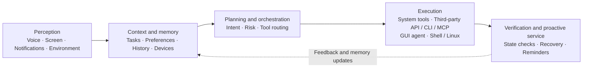

# Eta

[简体中文](README.md) | **English**

<p>   </p>

**A third-party, system-level AI agent for Android**

Eta helps models understand their users, use structured interfaces to read on-device data, call system APIs, and control the device. It can also use its GUI agent for tasks that must be completed through an app's interface, and enter full Root / Linux environments for broader, more complex work.

Eta can already watch the screen and order you a milk tea. But that also exposes the limits of GUI agents: interfaces are designed for people, so even a simple operation requires the model to repeatedly fetch screenshots and control information while navigating ads and pop-ups. Every step consumes context, reasoning, and model calls, making the same task far slower than invoking a structured interface directly. The GUI agent is an indispensable compatibility layer for today's closed app ecosystem, but it should not be the destination for AI phones.

What Eta wants is to open the capabilities hidden behind phone interfaces to the model itself: use structured tools with explicit schemas and results whenever the system can be reached directly; use an app's API or CLI when one is available; and turn to the GUI agent for the long tail of tasks with no machine-facing interface. Web tasks run in a built-in browser that the user can take over, while scripts, diagnostics, and heavier computation enter the Android Root shell or Alpine Linux. One Agent Runtime orchestrates every path, so the model does more than tap a phone—it gains a computer it can truly use.

And when photos, notifications, calendars, notes, recordings, location, and health summaries—even recent chat images from WeChat and QQ, food-delivery orders, and delivery updates—join long-term memory as context with your permission, Eta is no longer just carrying out commands. Over time, it can learn what matters to you, understand the story behind a request, help when needed, and remember who you are when you simply want to talk—both a capable assistant and a friend who understands you better. Closeness does not mean giving up boundaries: every capability has its own switch and execution scope, sensitive raw results are not written to persistent conversations, and you choose the model, what it may see and do, and when it must stop.

> [!NOTE]
> The Eta app targets rooted Android devices and is not limited to OPPO or Xiaomi hardware. ColorOS and HyperOS describe only the current system-assistant entry-point integrations: Eta can be selected as the default digital assistant on ColorOS, while Breeno and Super XiaoAI remain compatible entry points backed by the same Agent Runtime and BYOK model configuration. Complete system integration requires Root and LSPosed.

## See it in action

|                         GUI agent                          |                   Breeno BYOK from the power button                    |
| :--------------------------------------------------------: | :--------------------------------------------------------------------: |
|  |  |

|                  Chat workspace                   |                         Shell from Breeno                          |                    Native device tools                     |
| :-----------------------------------------------: | :----------------------------------------------------------------: | :--------------------------------------------------------: |
|  |  |  |

|                    Settings                     |                    Tool controls                    |                Skills                 |
| :---------------------------------------------: | :-------------------------------------------------: | :-----------------------------------: |
|  |  |  |

## From a request to a result

Eta is not a one-shot chat wrapper. Its runtime drives an agentic loop: the model responds with one or more tool calls, Eta validates and executes them, the results return to the conversation, and the model decides what to do next. The loop continues until the task is complete or the user stops it.

The runtime can combine four execution paths in a single task:

1. **Native tools** work with Android capabilities and selected on-device data sources.
2. **GUI / computer use** operates apps that expose no suitable machine interface.
3. **The embedded browser** loads and interacts with web applications without taking over the foreground.
4. **Android Shell and Alpine Linux** provide a complete command-line environment for diagnostics, scripting, and computation.

The model chooses the path; Eta owns validation, permissions, execution, cancellation, event streaming, and result persistence.

### System capabilities and on-device context

If Android already exposes a reliable system interface, Eta uses it instead of teaching the model how to navigate a Settings screen. Requests such as “set an alarm for 7 AM,” “pause playback,” “set media volume to 30%,” or “turn on Wi-Fi” become validated tool calls with dedicated executors and machine-readable results. When the task depends on the user's own context, Eta can also search selected system, OEM, and on-device data sources without opening each app by hand.

This is a growing capability layer rather than a fixed command list. Each system action or data source is added with its own contract and execution boundary instead of becoming another brittle GUI script.

- **Time and media:** create alarms and timers; control playback; adjust media, ring, notification, and alarm streams.
- **Device state:** inspect battery, charging, memory, storage, OS, uptime, and network state; toggle Wi-Fi and Bluetooth.
- **App insight:** identify the processes using the most memory and the apps consuming the most storage.
- **Privileged inspection:** read current notifications, a bounded notification history after explicit access is granted, app activity and usage, alarms, timers, location, DND, connected environment state, SMS verification codes, saved Wi-Fi credentials, Android Settings, and bounded system logs.
- **Personal context:** search photos, audio, recordings, shared files, downloads, calendar events, contacts, call history, SMS, clipboard history, and aggregate health data. On ColorOS, Eta can also search notes, to-dos, recording summaries, and system-memory records with related bills, schedules, pickup codes, shipments, places, attachments, and personal orders.
- **Chat image discovery:** find recent images in the verified QQ and WeChat cache locations, returning bounded file metadata and paths without reading message databases, chat text, or video.
- **General image reading:** pass a gallery URI or any absolute on-device image path to `read_image` for visual analysis. This is a general file-and-vision capability rather than a personal-data search tool. Multiple images are read one at a time to avoid overloading model requests.
- **Device administration:** update non-security-critical settings and stop, freeze, or unfreeze apps, while protecting core packages and security-sensitive settings.

| GUI-only mobile agents | Eta's native path |
| --- | --- |
| Capture a screen, identify a control, and simulate a tap | Invoke a narrowly scoped structured tool |
| Depend on coordinates, labels, and the current layout | Prefer stable Android system interfaces |
| Break on dialogs, animation, or redesigns | Avoid most Settings-page changes |
| Infer success from what the screen appears to show | Return a result the model can evaluate |
| Route every capability through the same UI layer | Give each capability its own schema and executor |

Eta does not rely on a keyword list or a handful of magic phrases. Once a capability is enabled, the model can select it from the task context. Enforcement happens at the execution boundary:

- Native device access, sensitive reads, and sensitive device actions are separate switches. They are currently enabled by default and are re-read by the Runtime before every execution.
- Arguments must pass the advertised tool schema and executor validation. Protected packages, security-critical settings, and out-of-range values remain blocked regardless of model output.
- Verification codes, Wi-Fi passwords, notification bodies, logs, and personal-data search results are available only to the active run; raw values are not written to persistent conversation history. After notification access is granted, Eta keeps at most 1,000 notification records on-device for seven days.
- Memory reads and writes are likewise persisted only as redacted operation summaries, not as raw tool arguments or results.

### GUI / computer use

When no stable API is available, Eta can work through the same interface as the user:

- capture the screen and read accessibility nodes tied to a specific snapshot;
- tap nodes or coordinates and perform verified four-direction scrolling;
- launch apps, explicitly hand links to external apps, press system keys, open the notification shade, and search installed apps;
- enter text, update and paste from the clipboard, and wait for specific text to appear;
- show an overlay and gesture feedback during foreground work so the user can see, interrupt, or take over the interaction.

GUI automation is the general compatibility layer, not the default route for capabilities Android can expose directly.

### Embedded browser

`browser_use` is an agent browser hosted inside Eta, not an `ACTION_VIEW` shortcut. It can load JavaScript-heavy pages offscreen, extract structured article content, locate and operate page elements, submit forms, scroll, and capture screenshots. When human intervention is useful—for example, to solve a CAPTCHA—the same WebView can be attached to the app UI for direct takeover.

Opening a link in another app remains the job of the separate `open_uri` tool.

The browser is not a security sandbox. Eta does not add URL, DNS, IP, host-count, method, redirect, or Service Worker interception on top of the system WebView. Local and mixed content, third-party cookies, autoplay, and form submission are allowed; Android WebView continues to enforce its own protocol, TLS, and permission behavior. Browser tools can be disabled in Settings.

### Terminal and files

With explicit user authorization, Eta can run `user` or `root` shell commands, read and write files, list directories, execute scripts, inspect logs, and update configuration. Stateful shell sessions retain their working directory and environment, while asynchronous jobs continue in the background and expose output incrementally. Terminal and file tools are currently enabled by default and can be disabled in Settings.

The chat composer can reference files or folders in internal storage and under `/data/local/tmp`. Eta displays the attachment name separately from the original request and adds only a Root-validated canonical absolute path to model context; it does not upload, copy, or cache the original. The system picker resolves internal-storage documents and recent items that map to local media-library paths. Cloud drives and other sources available only through `content://` URIs are not silently treated as uploads.

Two environments serve different jobs:

- **`android`** is the native Android shell for the OS, apps, logs, Magisk, and device files. Root sessions discover BusyBox supplied by Magisk, KernelSU, or APatch and use standalone `ash` so its applets do not need to be present in the system `PATH`.
- **`linux`** is an optional Alpine environment preloaded with model-friendly tools such as `rg`, `fd`, Git/SSH, diff/patch, curl, rsync, jq, SQLite, common archive utilities, and the Python toolchain. Eta downloads a pinned official minirootfs, verifies its SHA-256 digest, extracts it under app-private storage, and runs it through a dedicated mount namespace and Root chroot. Commands start in `/workspace`, which maps to Eta's Android workspace, while shared storage is available at `/sdcard`. It is not a sandbox and does not replace the Android environment.

### Long-term memory

Eta keeps cross-conversation memory in one app-private `MEMORY.md` file. There is no secondary extraction model and no background summarization job: the active model calls `memory_get` and `memory_write` when needed, and is responsible for deduplication, conflict resolution, and removing stale information.

- **Selective context:** each run receives only a bounded `# 核心记忆` (`Core Memory`) section, a heading index, and the current file revision; the model retrieves detailed sections on demand.
- **Adaptive budget:** the injected core budget scales with the selected model's context window, using 128K when the size is unknown and reserving room for history, tools, images, and the answer.
- **Atomic updates:** the file is capped at 1 MiB of UTF-8 data. Revision-checked writes prevent silent conflicts, and `AtomicFile` preserves the previous content if replacement fails.
- **User control:** Settings exposes usage, full Markdown editing, clearing, and an enable switch. Disabling memory preserves the file but immediately stops injection and rejects new memory tool calls.

### Skills

Skills are reusable, `SKILL.md`-based instruction bundles that Eta indexes and loads only when a task needs them.

- **Agent-assisted installation:** Eta can inspect public GitHub repositories, present candidate Skills, and install the model's selected candidates. The bundled `$skill-installer` is also available.
- **Local ZIP import:** the Skills screen accepts an archive containing exactly one Skill. Eta validates paths, sizes, structure, frontmatter, and `SKILL.md` in app-private staging before committing it.
- **Conflict protection:** user Skills are not overwritten by default. A replaceable GitHub conflict can be retried only against the same repository, commit, path, and Skill ID. Built-in Skills can never be overwritten by an import.
- **Progressive loading:** the model initially receives an index of enabled Skills and reads their instructions or referenced resources only when relevant. Newly installed Skills become available on the next conversation turn.

Installation stores files and updates the index; it does not execute packaged scripts or change terminal and file-tool settings. Agent-assisted installation currently supports public GitHub repositories only and does not accept private-repository tokens.

### Sessions and results

Runs started from an external system-assistant entry point are archived into Eta conversations. The app can recover pending results after its process has been killed, so work does not depend on the UI remaining alive.

Long-press a user message to copy, edit, or delete from that turn onward. Each final assistant response can also be regenerated. Editing, deleting, or regenerating a historical turn truncates that turn and every later model-context entry; Eta does not retain the old branch.

## What you can ask Eta to do

- **Native device actions:** “Set an alarm for 7 AM,” “pause the music,” or “set media volume to 30%,” using structured system interfaces first.
- **Understand your recent activity:** “What have I been busy with lately?”, “Have I been sleeping too late?”, or “Where did my time go today?”, drawing only on relevant calendar, notification, app-activity, health-summary, and on-device memory context.
- **Plan the day ahead:** combine tomorrow's schedule, places, and existing alarms to suggest when to leave, then create a reminder through a system capability.
- **Track what is happening now:** find order status, pickup codes, recent shipments, and delivery clues in system memory and the notification history saved after authorization.
- **Recover scattered information:** search recording summaries, files, photos, notes, and saved places for a book title, travel guide, or other detail the user remembers only approximately.
- **Review chat images:** find a bounded set of recent QQ or WeChat images, then inspect representative images one by one with the vision tool.
- **Cross-app GUI work:** handle unfinished items in an app, falling back to screen operation only when no direct capability exists.
- **Cross-app comparison:** analyze a product screenshot, open another shopping app, search for the same item, and return the findings.
- **Web research:** read JavaScript-rendered documentation or news in a persistent background browser session and hand control to the user when a challenge appears.
- **Terminal work:** inspect LSPosed logs, verify whether a Magisk module is active, clean up background processes, or update configuration through the shell.
- **Assistant-triggered workflows:** start a multi-step task from Eta's system-assistant text panel, Breeno, or Super XiaoAI and let the same Runtime carry it out.

## Models and BYOK

Eta's capabilities depend heavily on the model you connect.

- **Protocols:** OpenAI-compatible Chat Completions and the Anthropic Messages API, with Server-Sent Events (SSE), streamed tool calls, image input, and reasoning content.
- **Built-in providers:** OpenAI, Anthropic, Alibaba Cloud Model Studio, DeepSeek, Kimi, Xiaomi MiMo, MiniMax, StepFun, SiliconFlow, and OpenRouter.
- **Provider identity:** known providers use bundled full-color brand icons; unknown and custom endpoints retain a generic icon. Sources and licenses are listed in the [third-party notices](THIRD_PARTY_NOTICES.md).
- **Custom providers:** configure an HTTP or HTTPS base URL, API key, headers, and body JSON. Plain HTTP transmits the API key, prompts, and model content without transport encryption.
- **Model management:** use bundled official catalogs, synchronize remote model lists, or add models manually. Remote synchronization updates remote entries without deleting manual ones. Capability metadata returned explicitly by `/models` takes precedence; bundled provider catalogs fill only missing metadata, and presets remain isolated by provider.
- **Conversation drafts:** a new conversation remains a local draft until its first message is sent.

BYOK—Bring Your Own Key—means the agent follows the capabilities and policies of the model and provider you choose instead of being locked to one bundled service.

## System assistant and OEM entry points

### Eta as the native digital assistant

Eta registers a standard Android `VoiceInteractionService`, so it can be selected without first opening Breeno or XiaoAI. Open **Eta system assistant** on Eta's Settings page, then choose Eta in Android's digital-assistant picker.

The current session is a keyboard-driven text panel. It focuses the input field and opens the keyboard when shown, supports streamed responses, follow-up turns, cancellation, and result archiving, and hands foreground device work to the Agent operation overlay. This entry point does not currently start the microphone, speech recognition, or text-to-speech playback.

### ColorOS power-button target

Under **System assistant takeover** in Eta's Settings, the ColorOS long-press target can be selected explicitly:

| Target | Long-press behavior | Automatic default-assistant configuration |
| ------ | ------------------- | ----------------------------------------- |
| Breeno | Preserve the original ColorOS behavior | Never changes the system default assistant |
| Gemini | Use Google's existing system-assistant path | Switch to Gemini when the option is enabled |
| Eta | Open Eta's native text-assistant panel | Switch to Eta when the option is enabled |

New installations default to Breeno. Existing users who had enabled the former **Launch Gemini with the power button** option remain on Gemini. Automatic default-assistant configuration is a separate option and applies only to Gemini and Eta; when disabled, the matching assistant must be selected manually. If the selected target cannot start, that long press immediately falls back to Breeno. HyperOS power-button routing is not implemented yet.

### Breeno and Super XiaoAI compatibility

- **Breeno / Xiaobu on ColorOS:** Eta can take over the conversation entry point, inherit the current conversation's text context, parse image input, and send the request to the shared Runtime. BYOK is supported, and only requests beginning with `/agent` are claimed by default.
- **Super XiaoAI on HyperOS:** Eta correlates final ASR and `setQueryInfo` input with XiaoAI's regenerated `Nlp.Request` event, supports text plus one local image or screenshot, and suppresses native agent actions only for a successfully claimed turn. If a required prefix, image parsing, or queueing check fails, control returns to the native flow.

The Super XiaoAI adapter has been tested on version `7.13.32.0016` (`507013032`) on a physical device. These hooks depend on specific ROM and app implementations and may need adjustment after major updates.

### Gemini and Circle to Search on ColorOS

These features do not adapt system entry points that ColorOS already provides. Eta takes over assistant paths that normally belong to Breeno and creates or repairs the missing Google capability and trigger path:

- **Gemini unlock:** retain Google App eligibility repair, systemization, default-assistant and power-button routing, lock-screen and screen-on voice input, and screen-off hotword recovery. The power-button target can be switched back to Breeno or Eta at any time.
- **Circle to Search:** enable and repair Android's otherwise unavailable `contextual_search` service and Google App eligibility, then use navigation-handle long press and ColorOS two-finger screen recognition as triggers without modifying system files.

Gemini unlock and Circle to Search were Eta's original Google enablement features. They are no longer the project's main development focus, but they remain maintained.

## Installation

<details>
<summary><b>Show installation steps</b></summary>

1. Install the APK and open Eta.
2. Configure a model provider, API key, and active model.
3. Grant overlay, accessibility, installed-app visibility, location, and background-execution permissions as needed. Location is read only when the agent calls a time-and-location tool; background location is required for location tasks launched from an assistant entry point such as Breeno.
4. Enable native device tools, sensitive reads, sensitive device actions, and terminal/file tools as needed. Choose the terminal identity explicitly as `user` or `root`; install the optional Linux environment for tools such as Python and Git.
5. Enable Eta's accessibility service in Android Settings. If automatic recovery is required, explicitly enable **Keep accessibility service active** in Eta.
6. To use Eta as the native digital assistant, open **Eta system assistant** on the Settings page and select Eta in Android's system picker.
7. For ColorOS power-button routing, OEM-assistant takeover, ColorOS system memory, or Google capability enablement, activate the module in an LSPosed environment that supports libxposed API 102. Select the scopes required by the features you use; a complete setup includes `system`, SystemUI, the Google App, ColorOS screen recognition, Breeno, ColorOS memory, and Super XiaoAI. Then reboot the device.

</details>

### Accessibility protection

Accessibility protection is disabled by default. When enabled, the backend injected into `system_server` validates Eta's service declaration, caller UID, and APK signature. It reacts to changes in the accessibility service list, master switch, Eta package, and owner-user unlock state; it preserves other accessibility services and uses neither app autostart nor periodic polling.

If Eta remains in the enabled-service list but has no live connection, the backend restarts Eta only, with at most three progressive attempts followed by a one-minute cooldown. When ColorOS repeatedly removes the setting, write-back delay backs off from 300 ms to 30 seconds and resets after one stable minute. Turning protection off stops maintenance without disabling the currently configured service.

GUI tools still require a real service connection. If protection is off, the `system` scope is inactive, or rebinding times out, the action fails explicitly; Eta does not silently use Root or Shell to rewrite accessibility settings.

If the app control is unavailable, protection can be stopped over ADB before disabling the service in Android Settings:

```bash
adb shell settings put global eta_accessibility_protection_enabled 0
```

Deleting that setting restores the default disabled state. During development, if the APK signature has intentionally changed and the APK source is trusted, clear the pinned signer as well:

```bash
adb shell settings delete global eta_app_signer_sha256
```

## Security model and limitations

- **Third-party integration limits:** Eta does not have every private permission available to OEM components. UI continuity, animations, and system-level polish may be weaker than a built-in assistant.
- **Version sensitivity:** system-entry hooks depend on particular ROM, framework, and target-app implementations. Major OS or app updates can require a new adapter.
- **HyperOS verification status:** Super XiaoAI `7.13.32.0016` (`507013032`) has been verified on a physical device.
- **Authorization boundaries:** Xposed, `root`, accessibility, and overlays are enabled only as needed. Terminal and sensitive device capabilities can be disabled independently in Settings, while foreground GUI work retains its overlay, gesture feedback, interruption, and user-takeover paths.

## Why Eta takes a different path

Large commercial mobile assistants have already shown that phone AI can move beyond chat and act across the system. They also operate inside platform, partnership, payment, and compliance constraints: cross-app control can trigger login protection, human-verification challenges, or warnings from high-risk apps.

Eta is built from a third-party, user-controlled perspective. It does not represent a phone vendor or depend on preinstallation agreements. A user who chooses to unlock and root a device, enable Xposed, and grant accessibility access should be able to connect the phone's assistant entry points to a model of their choice—with visible tools, revocable permissions, and an interaction the user can stop or take over.

It also rejects the idea that every action must look like a person tapping through screens. If Android has a stable interface for Wi-Fi, alarms, media, or device state, Eta exposes a structured tool. GUI operation remains essential for the long tail of closed apps, but it should be the compatibility path rather than the entire architecture.

Finally, Eta places terminal execution inside the Agent Runtime. A model that can run authorized shell commands, inspect files, execute scripts, and change configuration can turn intent into operations in the same way a coding agent does. The GUI is the phone's visible surface; the terminal is its general-purpose computing environment.

## Toward an Agentic OS

> [!NOTE]
> This section describes Eta's product and architecture perspective. It is not a list of features already implemented in full.

An AI-native phone should be more than a stronger chatbot, and “click the screen for the user” should not be the endpoint. The operating system can evolve from an app-and-GUI-centric model toward an **Agentic OS** organized around user intent, context, and an Agent Runtime: the user states a goal, the system plans within an authorization boundary, selects the right apps, services, device capabilities, and hardware, verifies the outcome, and reports back.

Apps would not disappear. They would increasingly serve as data, services, and specialized human interfaces behind the agent, exposing machine-readable capabilities through APIs, CLIs, the open-source [Model Context Protocol (MCP)](https://modelcontextprotocol.io/docs/getting-started/intro), or Android [AppFunctions](https://developer.android.com/ai/appfunctions). The AppFunctions API is currently experimental; it gives authorized agents an on-device way to discover and invoke app-provided tools. GUI remains important for presentation, critical confirmation, user takeover, and apps that expose no machine interface.

The operating system can also serve as a context layer for the model. A system-level agent can work with the active screen and notifications as well as photos, calendars, contacts, calls, messages, notes, recordings, and device state, then relate those signals to time, location, habits, preferences, and longer-running goals. Eta already implements part of this model: purpose-built search tools return bounded results, while a separate general-purpose image tool can inspect an explicit path. The goal is not indiscriminate collection. It is to retrieve the context that matters for the task, when it matters. A mature OEM implementation should go further with sensitivity classification, provenance, usage records, and revocation.

An Agentic OS should route execution according to availability, speed, reliability, permissions, and risk:

1. **Native system and on-device data:** use OS APIs, providers, verified local data sources, and dedicated tools for device state, task context, hardware, and system actions.
2. **Structured third-party capabilities:** use public APIs, CLIs, MCP servers, AppFunctions, or other authorized interfaces when an app or service provides them.
3. **GUI agents for closed ecosystems:** use screenshots, accessibility nodes, vision, and coordinates when no machine interface exists.
4. **Shell and Linux for general computation:** use the file system, scripts, diagnostics, and development tools under explicit user authorization.

> [!IMPORTANT]
> APIs, CLIs, MCP, and AppFunctions can make third-party apps or services directly operable only when their owners expose or authorize those interfaces. Root can let Eta read data already present on the user's device through a verified provider or file layout, such as a chat image cache, but that is not the same as gaining access to an app's private business API or understanding an undocumented protocol. Eta does not expose arbitrary databases, URIs, or SQL to the model. Closed third-party workflows still require the GUI agent unless Eta has a dedicated data adapter.



| Architecture layer | A future Agentic OS | Eta today |
| --- | --- | --- |
| Perception and context | Screen, voice, notifications, calendar, time and location, habits, memory, and cross-device state | Image input and local-path reading, screen observation, accessibility nodes, time and location, device state, recent notifications, photos, files, calendars, contacts, calls, SMS, ColorOS notes and recordings, QQ and WeChat image caches, conversation history, and on-demand memory |
| Planning and orchestration | Intent understanding, planning, risk assessment, and model routing | Agentic loop, tool schemas, system constraints, steering, and cancellation |
| Capability routing | Native system calls; structured third-party APIs, CLIs, MCP, or AppFunctions; GUI coverage for closed apps | Android tools, system and OEM providers, verified local file data, GUI agent, browser, Skills, and terminal tools; no private third-party business APIs |
| Execution environment | Apps, system services, files, sensors, compute units, and multiple devices | Android `user`/`root` shell, file tools, and Alpine Linux |
| Outcome loop | State verification, recovery, risk-based confirmation, and proactive service | Structured tool results, renewed observation, state waits, event streams, result archiving, and user takeover |

For an OEM Agentic OS, the advantage over an ordinary AI app is not only a stronger model. It is the ability to provide continuous but controlled system context, maintain governable memory, orchestrate capabilities across apps and devices, and turn answers into verified outcomes. That power requires restraint: task-scoped context, transparent data use, visible sensing, explicit sensitive permissions, risk-aware confirmation, interruptible execution, and auditable results.

Eta is exploring the part of this direction that can be built today within Android, Root, accessibility, and user-granted boundaries. One Runtime coordinates system and personal-data tools, general image vision, GUI operation, the browser, Shell, Linux, Skills, and on-demand memory. Together, those layers connect Android capabilities, on-device context, and the long tail of app interfaces. A more complete Agentic OS will also require cross-device state, on-device models, hardware scheduling, stronger data governance, and a participating third-party ecosystem.

## Project layout

Core code lives under `../app/src/main/kotlin/fuck/andes/`:

```text
ModuleMain.kt              libxposed module entry point
Application layer          App initialization

hook/system/               system_server and SystemUI hooks
hook/google/               Google App process hooks
hook/colordirect/          ColorDirectService hooks
hook/breeno/               Breeno entry-point takeover
hook/xiaoai/               Super XiaoAI entry-point takeover

agent/runtime/             Agent Runtime, IPC, and result archiving
agent/voice/               Native digital-assistant role, text session, and Runtime handoff
agent/memory/              Long-term memory budgets and selective context
agent/model/               Provider abstractions and SSE parsing
agent/tool/                Local tool executors
agent/media/               Image decoding, compression, and model input
agent/browser/             Shared offscreen browser and web interaction
agent/device/              Root, accessibility, and input control
agent/terminal/            Android/Alpine shells, installation, and file tools
agent/overlay/             Runtime overlay and gesture feedback
agent/skill/               Skill parsing, installation, bounded reads, and indexing
agent/accessibility/       Accessibility service, snapshots, protection, and health

data/db/                   Room conversations, providers, and run archives
data/repository/           Persistence and domain repositories
data/provider/             Built-in providers and official model catalogs

ui/app/                    Root app state and navigation
ui/screens/                Feature screens
ui/pages/providers/        Provider management
ui/components/             Shared UI components
systemizer/                Google App systemizer installer
config/Prefs.kt            RemotePreferences configuration
```

See [Agent Runtime](AGENT_RUNTIME.md) for loop, tool-batch, steering, and transcript semantics. See [Technical Implementation](TECHNICAL.md) for personal-data tools, file vision, Gemini, Circle to Search, and RemotePreferences internals. These technical documents are currently maintained in Chinese.

## References and acknowledgements

- [Pi Coding Agent](https://github.com/earendil-works/pi), the main reference for Eta's agent loop, tool calling, steering, and transcript state model.
- [OmniBot](https://github.com/omnimind-ai/OmniBot), a reference project for Android-based AI agents.

Eta implements these ideas independently around its own Xposed entry points, Android Runtime, IPC, and provider protocol boundaries.

## License

Eta's source code is available for personal learning, research, modification, and noncommercial use under the [PolyForm Noncommercial License 1.0.0](../LICENSE).

Without written permission from the author, you may not sell the project, its source code, APK, or modified versions, or use it for paid distribution, paid installation, or other commercial services. For commercial licensing, contact [Mangi (Mangi-11)](https://github.com/Mangi-11) through GitHub.

Third-party dependencies, icons, and brand assets remain under their respective licenses and are not relicensed by Eta. See the [third-party notices](THIRD_PARTY_NOTICES.md).

To keep commercial licensing possible under a single grant, external code contributions can be merged only after a Contributor License Agreement process has been established. Until then, suggestions and bug reports are welcome through Issues.

<sub>Community: <a href="https://linux.do">LINUX DO</a></sub>
