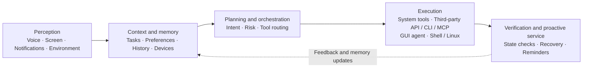

# Eta

[简体中文](README.md) | **English**

   

**A third-party, system-level AI agent for Android**

With Root and LSPosed, Eta crosses the app sandbox and works at the system layer: hooking system components, taking over the power button and OEM assistant entries, and reading private data from OEM and third-party apps alike. These capabilities—close to an OEM assistant's, yet freer—are all open to the models you connect yourself (ChatGPT, DeepSeek, Kimi, and more, with your own API keys—BYOK):

- **Direct system APIs** — alarms, media, volume, Wi-Fi, and more, callable directly by the model
- **Personal context** — photos, calendar, SMS, notifications, recordings, health summaries, ColorOS system memory, and recent QQ / WeChat chat images, read on demand
- **Built-in browser** — loads pages in the background, extracts content, and interacts with page elements; the user can take over when needed
- **Root / Linux environment** — a complete shell environment: authorized commands, file access, and scripts, giving the model unlimited room to improvise
- **GUI agent** — third-party apps exposing APIs or CLIs would be the ideal path, but the closed mobile ecosystem leaves most apps without any machine interface; and interfaces are designed for people, inherently unfriendly to models. The long tail without an interface is handled by watching the screen and acting on controls

Other third-party phone agents serve mainstream users, and mainstream users don't have Root—so their capabilities stay inside the app sandbox, while system entry points and data belong to the vendor. Desktop coding agents (Codex, Claude Code) or OpenClaw, when ported directly onto a phone, remain a lobster trapped in the sandbox: no complete system environment, no way to operate the real Android device. And OEM assistants, constrained by their own ecosystems, don't touch third-party app data.

Eta can already watch the screen and order you a milk tea, but tapping screens should not be the destination. When the system can be reached directly, there is no need to simulate taps—the phone in the model's hands is a computer it can actually use.

Your phone holds most of your data. With your permission, photos, notifications, calendars, notes, recordings, location, and health summaries join long-term memory as context, and Eta goes beyond carrying out commands: it gradually learns what matters to you and understands the story behind a request. No friend knows you better than your phone, and Eta can be that friend. Closeness does not mean giving up boundaries: every capability has its own switch, and you choose the model, what it may see and do, and when it must stop.

> [!NOTE]
> Full capability requires **Root** and **LSPosed** with libxposed API 102. The app itself is not limited to OPPO or Xiaomi hardware; ColorOS (Breeno) and HyperOS (XiaoAI) describe only the current system-assistant entry-point integrations.

## See it in action

|                         GUI agent                          |                   Breeno BYOK from the power button                    |
| :--------------------------------------------------------: | :--------------------------------------------------------------------: |
|  |  |

|                  Chat workspace                   |                         Shell from Breeno                          |                    Native device tools                     |
| :-----------------------------------------------: | :----------------------------------------------------------------: | :--------------------------------------------------------: |
|  |  |  |

|                    Settings                     |                    Tool controls                    |                Skills                 |
| :---------------------------------------------: | :-------------------------------------------------: | :-----------------------------------: |
|  |  |  |

## What it does

Eta is not a one-shot chat wrapper: the model issues instructions, Eta executes them, results return to the conversation, and the model decides what to do next—until the task is done. Four execution paths combine within a single task:

| Path | What it covers |
| ---- | -------------- |
| **Native device tools** | Alarms, timers, media control, volume, Wi-Fi / Bluetooth, device and storage state, plus on-device search across photos, calendar, contacts, SMS, notifications, health summaries, and ColorOS notes and system memory—all structured tools with explicit schemas |
| **Embedded browser** | Loads JavaScript-heavy pages offscreen, extracts structured content, and operates page elements; when human intervention helps (e.g. a CAPTCHA), the same WebView attaches to the app UI for direct takeover |
| **Terminal and files** | Authorized `user` / `root` shell commands, file access, and scripts; choose either lightweight Alpine (musl) or broader Debian glibc, install the base environment first, then add tools as needed; China-network installs prefer one measured domestic mirror with an official fallback |
| **GUI / computer use** | Screenshots, accessibility nodes, tapping, scrolling, and text input, with an overlay and gesture feedback during foreground work that you can interrupt or take over. Covers the long tail of apps with no machine interface |

On top of that:

- **Long-term memory:** cross-conversation memory lives in one on-device `MEMORY.md`, injected on demand per task; Settings exposes usage, full editing, clearing, and an off switch
- **Skills:** browse and install Skills from public GitHub repositories or import a local ZIP; the model reads them on demand, and installation never executes packaged scripts
- **MCP tools:** connect remote Streamable HTTP servers and add individually enabled third-party tools to the Agent Loop; supports HTTP / HTTPS and an optional bearer token
- **Sessions and results:** runs started from external entry points are archived into Eta conversations and recovered after process death; long-press a message to copy, edit, or delete from that turn, and regenerate any final response

## What you can ask Eta to do

- **Native device actions:** “Set an alarm for 7 AM,” “pause the music,” “set media volume to 30%,” using structured system interfaces first
- **Understand your recent activity:** “What have I been busy with lately?”, “Have I been sleeping too late?”, drawing only on relevant calendar, notification, app-activity, health-summary, and memory context
- **Plan the day ahead:** combine tomorrow's schedule, places, and existing alarms to suggest when to leave, then create the reminder through a system capability
- **Track what is happening now:** find order status, pickup codes, and shipments in system memory and the notification history saved after authorization
- **Recover scattered information:** search recording summaries, files, photos, and notes for a book title or place you only vaguely remember
- **Review chat images:** find recent QQ or WeChat images, then inspect representative ones with the vision tool
- **Cross-app work and comparison:** finish to-dos inside an app, or analyze a product screenshot and search for the same item in another shopping app—falling back to screen operation only when no direct capability exists
- **Web research:** read JavaScript-rendered pages in a persistent background session, handing control to you when a challenge appears
- **Terminal work:** “Inspect LSPosed logs for hook errors, check whether my Magisk module is active, and clean up background processes”
- **Assistant-triggered workflows:** start multi-step tasks from Eta's assistant panel, Breeno, or Super XiaoAI and let the same Runtime carry them out

## System assistant and OEM entry points

### Eta as the native digital assistant

Eta registers a standard Android `VoiceInteractionService`: open **Eta system assistant** on the Settings page, then choose Eta in Android's digital-assistant picker. Invocation shows a full-screen panel with the keyboard focused, supports streamed answers, follow-up turns, cancellation, and result archiving, and can attach the screen from before invocation as image context for the next message. Speech recognition and text-to-speech playback are not currently provided.

### ColorOS power-button target

Under **System assistant takeover** in Eta's Settings, the ColorOS long-press target can be selected explicitly:

| Target | Long-press behavior | Automatic default-assistant configuration |
| ------ | ------------------- | ----------------------------------------- |
| Breeno | Preserve the original ColorOS behavior | Never changes the system default assistant |
| Gemini | Use Google's existing system-assistant path | Switch to Gemini when the option is enabled |
| Eta | Open Eta's native text-assistant panel | Switch to Eta when the option is enabled |

New installations default to Breeno; users who had enabled the former **Launch Gemini with the power button** option remain on Gemini. Automatic default-assistant configuration is a separate option and applies only to Gemini and Eta. If the selected target cannot start, that long press immediately falls back to Breeno. HyperOS power-button routing is not implemented yet.

### Breeno and Super XiaoAI

- **Breeno (ColorOS):** takes over the conversation entry point, inherits the current conversation's text context, parses image input, and hands the request to the shared Agent Runtime. BYOK is supported, and only requests beginning with `/agent` are claimed by default
- **Super XiaoAI (HyperOS):** supports text plus one local image or screenshot, and returns to the native flow if any precondition check fails. Verified on version `7.13.32.0016` (`507013032`) on a physical device

### Gemini and Circle to Search (ColorOS)

These features do not depend on entry points ColorOS already provides—Eta creates or repairs them:

- **Gemini unlock:** Google App device-eligibility repair, systemization, default-assistant and power-button routing, plus lock-screen / screen-on voice input and screen-off hotword compensation
- **Circle to Search:** enable and repair Android's otherwise unavailable `contextual_search` service and Google App eligibility, then use navigation-handle long press and two-finger screen recognition as triggers without modifying system files

Gemini unlock and Circle to Search were Eta's original Google enablement features. They are no longer the main development focus, but they remain maintained.

## Models and BYOK

- **Protocols:** OpenAI-compatible Chat Completions, Responses API, and Anthropic Messages, with SSE streaming, tool calls, image input, and reasoning content; Responses can show reasoning summaries and enable server-side web search per provider
- **Built-in providers:** OpenAI, Anthropic, Alibaba Cloud Model Studio, DeepSeek, Kimi, Xiaomi MiMo, MiniMax, StepFun, SiliconFlow, and OpenRouter
- **Custom providers:** HTTP/HTTPS base URL, API key, headers, and body JSON; plain HTTP transmits the API key, prompts, and model content without transport encryption
- **Model management:** bundled official catalogs, remote list sync, custom models, and fuzzy search; context-length and reasoning-effort overrides always win over later remote syncs, and each provider remembers its last selected model
- **Data backup:** Settings can export or import conversations, model provider configuration, and `MEMORY.md` for package-name changes or device migration; backup files contain provider API keys and should be stored securely

BYOK—Bring Your Own Key—means the agent follows the capabilities of the model and provider you choose instead of being locked to one bundled service.

## Installation

<b>Show installation steps</b>

1. Install the APK, open Eta, and configure a model provider, API key, and active model.
2. Grant overlay, accessibility, installed-app visibility, location, notification-access, usage-access, and background-execution permissions as needed; location tasks launched from assistant entry points such as Breeno require “allow all the time”.
3. Enable native device tools, sensitive reads, sensitive device actions, and terminal/file tools as needed; remote MCP servers can be added under **Context & extensions**, where each tool is enabled individually; choose the terminal identity explicitly as `user` or `root`, and install the optional Linux environment for tools such as Git, with the Python toolchain installable on demand inside it.
4. Enable Eta's accessibility service in Android Settings.
5. Optional system entry points:
   - Native digital assistant: open **Eta system assistant** on the Settings page and select Eta in Android's system picker
   - ColorOS power-button routing, OEM-assistant takeover, ColorOS system memory, Gemini, and Circle to Search: activate the module in an LSPosed environment with libxposed API 102, select the scopes you need (`system`, SystemUI, Google App, ColorOS screen recognition, Breeno, ColorOS memory, Super XiaoAI), then reboot

## Security model

- Native device access, sensitive reads, sensitive device actions, terminal/file tools, browsing, and memory are independent switches, currently enabled by default and re-read by the Runtime before every execution—you can turn any of them off at any time
- Tool arguments must pass the advertised schema and executor validation; core packages and security-critical settings remain protected regardless of model output
- Verification codes, Wi-Fi passwords, notification bodies, logs, and personal-data search results are available only to the active run and are never written to persistent conversation history; after notification access is granted, Eta keeps at most 1,000 notification records on-device for seven days
- Memory reads and writes likewise serve only the active run, persisted as redacted summaries; files referenced in chat contribute only a Root-validated path to model context—never an upload or copy of the original
- Foreground GUI work shows an overlay with gesture feedback and can be interrupted or taken over at any time

## Limitations

- **Third-party integration limits:** Eta does not have every private permission available to OEM components. UI continuity, animations, and system-level polish may be weaker than a built-in assistant.
- **Version sensitivity:** system-entry hooks depend on particular ROM, framework, and target-app implementations. Major OS or app updates can require a new adapter.

## Why Eta: my take on the AI phone

### Why Eta takes a different path

Large commercial mobile assistants have already shown that phone AI can move beyond chat and act across the system. They also operate inside platform, partnership, payment, and compliance constraints: cross-app control can trigger login protection, human-verification challenges, or warnings from high-risk apps.

Eta is built from a third-party, user-controlled perspective. It does not represent a phone vendor or depend on preinstallation agreements. A user who chooses to unlock and root a device, enable Xposed, and grant accessibility access should be able to connect the phone's assistant entry points to a model of their choice—with visible tools, revocable permissions, and an interaction the user can stop or take over.

It also rejects the idea that every action must look like a person tapping through screens. If Android has a stable interface for Wi-Fi, alarms, media, or device state, Eta exposes a structured tool. GUI operation remains essential for the long tail of closed apps, but it should be the compatibility path rather than the entire architecture.

Finally, Eta places terminal execution inside the Agent Runtime. A model that can run authorized shell commands, inspect files, execute scripts, and change configuration can turn intent into operations in the same way a coding agent does. The GUI is the phone's visible surface; the terminal is its general-purpose computing environment.

### Toward an Agentic OS

> [!NOTE]
> This section describes Eta's product and architecture perspective. It is not a list of features already implemented in full.

An AI-native phone should be more than a stronger chatbot, and “click the screen for the user” should not be the endpoint—and porting a desktop coding agent onto a phone does not answer what an AI phone should be, either. The operating system can evolve from an app-and-GUI-centric model toward an **Agentic OS** organized around user intent, context, and an Agent Runtime: the user states a goal, the system plans within an authorization boundary, selects the right apps, services, device capabilities, and hardware, verifies the outcome, and reports back.

Apps would not disappear. They would increasingly serve as data, services, and specialized human interfaces behind the agent, exposing machine-readable capabilities through APIs, CLIs, the open-source [Model Context Protocol (MCP)](https://modelcontextprotocol.io/docs/getting-started/intro), or Android [AppFunctions](https://developer.android.com/ai/appfunctions). The AppFunctions API is currently experimental; it gives authorized agents an on-device way to discover and invoke app-provided tools. GUI remains important for presentation, critical confirmation, user takeover, and apps that expose no machine interface.

The operating system can also serve as a context layer for the model. A system-level agent can work with the active screen and notifications as well as photos, calendars, contacts, calls, messages, notes, recordings, and device state, then relate those signals to time, location, habits, preferences, and longer-running goals. Eta already implements part of this model: purpose-built search tools return bounded results, while a separate general-purpose image tool can inspect an explicit path. The goal is to retrieve the context that matters for the task, when it matters—not indiscriminate collection. A mature OEM implementation should go further with sensitivity classification, provenance, usage records, and revocation.

An Agentic OS should route execution according to availability, speed, reliability, permissions, and risk:

1. **Native system and on-device data:** use OS APIs, providers, verified local data sources, and dedicated tools for device state, task context, hardware, and system actions.
2. **Structured third-party capabilities:** use public APIs, CLIs, MCP servers, AppFunctions, or other authorized interfaces when an app or service provides them.
3. **GUI agents for closed ecosystems:** use screenshots, accessibility nodes, vision, and coordinates when no machine interface exists.
4. **Shell and Linux for general computation:** use the file system, scripts, diagnostics, and development tools under explicit user authorization.

> [!IMPORTANT]
> APIs, CLIs, MCP, and AppFunctions can make third-party apps or services directly operable only when their owners expose or authorize those interfaces. Root can let Eta read data already present on the user's device through a verified provider or file layout, such as a chat image cache, but that is not the same as gaining access to an app's private business API or understanding an undocumented protocol. Eta does not expose arbitrary databases, URIs, or SQL to the model. Closed third-party workflows still require the GUI agent unless Eta has a dedicated data adapter.

| Architecture layer | A future Agentic OS | Eta today |
| --- | --- | --- |
| Perception and context | Screen, voice, notifications, calendar, time and location, habits, memory, and cross-device state | Image input and local-path reading, screen observation, accessibility nodes, time and location, device state, recent notifications, photos, files, calendars, contacts, calls, SMS, ColorOS notes and recordings, QQ and WeChat image caches, conversation history, and on-demand memory |
| Planning and orchestration | Intent understanding, planning, risk assessment, and model routing | Agentic loop, tool schemas, system constraints, steering, and cancellation |
| Capability routing | Native system calls; structured third-party APIs, CLIs, MCP, or AppFunctions; GUI coverage for closed apps | Android tools, system and OEM providers, verified local file data, GUI agent, browser, Skills, and terminal tools; no private third-party business APIs |
| Execution environment | Apps, system services, files, sensors, compute units, and multiple devices | Android `user`/`root` shell, file tools, and the selected Alpine Linux or Debian glibc environment |
| Outcome loop | State verification, recovery, risk-based confirmation, and proactive service | Structured tool results, renewed observation, state waits, event streams, result archiving, and user takeover |

For an OEM Agentic OS, the advantage over an ordinary AI app goes beyond a stronger model: it can provide continuous but controlled system context, maintain governable memory, orchestrate capabilities across apps and devices, and turn answers into verified outcomes. That power requires restraint: task-scoped context, transparent data use, visible sensing, explicit sensitive permissions, risk-aware confirmation, interruptible execution, and auditable results.

Eta is exploring the part of this direction that can be built today within Android, Root, accessibility, and user-granted boundaries. One Runtime coordinates system and personal-data tools, general image vision, GUI operation, the browser, Shell, Linux, Skills, and on-demand memory. Together, those layers connect Android capabilities, on-device context, and the long tail of app interfaces. A more complete Agentic OS will also require cross-device state, on-device models, hardware scheduling, stronger data governance, and a participating third-party ecosystem.

## Going deeper

- [Technical Implementation](TECHNICAL.md) — hook chains, on-device data access, file vision, browser, terminal, memory, and accessibility protection internals (Chinese)
- [Agent Runtime](AGENT_RUNTIME.md) — loop, tool-batch, steering, and transcript semantics (Chinese)

## References and acknowledgements

- [Pi Coding Agent](https://github.com/earendil-works/pi), the main reference for Eta's agent loop, tool calling, steering, and transcript state model.
- [OmniBot](https://github.com/omnimind-ai/OmniBot), a reference project for Android-based AI agents.
- [libxposed API](https://github.com/libxposed/api) — modern Xposed API.
- [Miuix](https://github.com/compose-miuix-ui/miuix) — UI component library.

## License

Eta's source code is available for personal learning, research, modification, and noncommercial use under the [PolyForm Noncommercial License 1.0.0](../LICENSE).

Without written permission from the author, you may not sell the project, its source code, APK, or modified versions, or use it for paid distribution, paid installation, or other commercial services. For commercial licensing, contact [Mangi (Mangi-11)](https://github.com/Mangi-11) through GitHub.

Third-party dependencies, icons, and brand assets remain under their respective licenses and are not relicensed by Eta. See the [third-party notices](THIRD_PARTY_NOTICES.md).

To keep commercial licensing possible under a single grant, external code contributions can be merged only after a Contributor License Agreement process has been established. Until then, suggestions and bug reports are welcome through Issues.

Community: <a href="https://linux.do">LINUX DO</a>
